# 🎮 Awesome PC Gaming Hub App Ecosystem

  

> **Curated List of Commercial SaaS Gaming Hubs & Open-Source PC Game Launchers**  
> *Discover top tools for Game Library Management, Multi-Store Aggregation, Cross-Platform Sync, and Emulator Frontends.*

---

## 💡 Overview & Market Insights 📊

The **PC Gaming Hub & Launcher ecosystem** is estimated to be a **$45B+ global market** (encompassing digital storefront distribution, launcher subscriptions, and game management platforms). 

The market structure is **highly concentrated (Winner-Take-Most)**:
- **Dominant Aggregators**: **Steam (Valve)** commands the vast majority of PC game store transactions and daily active launcher users.
- **Ecosystem Publishers**: Major publisher hubs (**Microsoft Xbox**, **Epic Games**, **EA**, **Ubisoft**, **Battle.net**) hold captive audiences for exclusive titles and subscription services.
- **Open-Source Unifiers**: **Playnite**, **Heroic Games Launcher**, **Lutris**, and **Hydra** serve power users and Linux/Steam Deck gamers seeking unified library management without store lock-in.

---

## 📑 Table of Contents
- [🏢 SaaS & Hosted Platforms](#-saas--hosted-platforms)
- [⚡ Open-Source GitHub Projects](#-open-source-github-projects)
- [🤝 How to Contribute](#-how-to-contribute)
- [💖 Support & Sponsorship](#-support--sponsorship)
- [⚠️ Disclaimer](#%EF%B8%8F-disclaimer)
- [⭐ Star History](#-star-history)

---

## 🏢 SaaS & Hosted Platforms

The commercial PC gaming hub market features mega-cap technology corporations and top gaming publishers. Sorted by company size / market valuation (descending):

| 🏢 Product | 📌 Description | 💰 Company Valuation / Revenue | 💳 Pricing (Starting Tier) | 🎁 Free Tier Limits |
| :--- | :--- | :--- | :--- | :--- |
| **[Microsoft Xbox App](https://www.xbox.com/en-US/apps/xbox-app-for-windows-10)** | Microsoft's unified gaming hub for Windows — Game Pass integration, cloud gaming, and Xbox ecosystem. | **~$3.1 Trillion** Market Cap (Microsoft) | Free app; PC Game Pass starts at $13.99/month | Free app download & store access; 14-day trial available via $1 promo or referral codes |
| **[EA app](https://www.ea.com/ea-app)** | EA's desktop launcher replacing Origin — EA games, EA Play subscription, and cloud saves. | **~$38 Billion** Market Cap (Electronic Arts) | Free app; EA Play starts at $5.99/month ($39.99/year) | Free app download & store access; paid members get 10-hour trial per new release |
| **[Epic Games Launcher](https://store.epicgames.com/)** | Leading Steam competitor — free weekly games, Unreal Engine integration, and exclusive titles. | **~$31.5 Billion** Valuation (Epic Games) | Free to download & use; 12% developer revenue share (0% on first $1M annual revenue) | Unlimited access to launcher, weekly free game giveaways, and F2P titles |
| **[Steam](https://store.steampowered.com/)** | The dominant PC gaming platform — 50,000+ games, Steam Workshop, Proton for Linux, and community hub. | **~$10 Billion+** Estimated Valuation (Valve Corp; ~$9B+ annual revenue) | Free to download & use; 30% developer revenue cut ($100 Steam Direct fee/game) | Unlimited free client access, free-to-play games, cloud storage & community features |
| **[Battle.net](https://www.blizzard.com/)** | Blizzard's flagship launcher — World of Warcraft, Overwatch, Diablo, and Call of Duty. | **~$9 Billion** (Subsidiary revenue under Activision Blizzard / MSFT) | Free to download & use; individual game/subscription purchases required | Unlimited free launcher access; free level-capped trial up to Level 20 for WoW & F2P titles |
| **[Ubisoft Connect](https://ubisoftconnect.com/)** | Ubisoft's game launcher — Ubisoft+ subscription, cross-platform progression, and rewards. | **~$2.8 Billion** Market Cap (Ubisoft) | Free app; Ubisoft+ Premium starts at $17.99/month | Free app download & store access; occasional 7-day or limited promotional free trials |
| **[Razer Cortex](https://www.razer.com/cortex)** | Game booster and library manager — RAM optimization, system cleanup, and price comparison. | **~$2.5 Billion** Valuation (Razer Inc.) | 100% Free forever (no paid tier) | Unlimited free access to Game Booster & System Cleaner; daily cap on Razer Silver reward earnings |
| **[GOG Galaxy](https://www.gog.com/galaxy)** | DRM-free gaming with cross-store library integration — connect Steam, Epic, Xbox, and PlayStation accounts. | **~$300 Million** Parent Valuation (CD Projekt S.A.) | Free to download & use; 30% developer store commission | Unlimited free use of launcher, cross-store library sync, and DRM-free offline installers |
| **[LaunchBox](https://www.launchbox-app.com/)** | Premium game launcher and emulator frontend — Big Box mode for TV displays, emulator support, and metadata scraping. | **Independent / Bootstrapped** | Free tier available; Premium license starts at $30 (1-yr updates) or $75 (Lifetime) | Windows free desktop version has full functionality but excludes Big Box TV mode; Android free tier capped at 100 games |

---

## ⚡ Open-Source GitHub Projects

Open-source game library managers and emulation frontends offer high privacy, theme customization, and cross-platform flexibility for Windows, Linux, and Steam Deck users. Sorted by GitHub_Stars_Count (descending):

- **[Playnite](https://github.com/JosefNemec/Playnite)**   
  🏆 **The leading open-source game library manager** (MIT licensed). Unifies Steam, Epic, GOG, EA, Ubisoft, Battle.net, Amazon, Xbox, and emulators into one interface. Fullscreen mode with controller support for TV/couch gaming, IGDB metadata integration, playtime tracking, themes, and extensions. **Best for uniting scattered game libraries on Windows**.

- **[Heroic Games Launcher](https://github.com/Heroic-Games-Launcher/HeroicGamesLauncher)**   
  🐧 **Free, open-source launcher for Epic, GOG, and Amazon Games** (GPL-3.0). Cross-platform (Windows, macOS, Linux, Steam Deck). Features Wine/Proton compatibility, Easy Anti-Cheat support, DXVK, VKD3D, and cloud saves. **The de facto open-source choice for non-Steam games on Linux**.

- **[RetroArch](https://github.com/libretro/RetroArch)**   
  🕹️ **Frontend for emulators, game engines, and media players** (GPL-3.0). Enables running classic games on a wide range of computers and consoles through its slick modular GUI interface. Features netplay, real-time rewind, shaders, and retro achievements.

- **[Hydra Launcher](https://github.com/hydralauncher/hydra)**   
  ⚡ **Modern open-source game launcher with embedded features** (MIT licensed). Download and manage games from multiple sources with a sleek desktop UI.

- **[Lutris](https://github.com/lutris/lutris)**   
  🐧 **Open-source gaming platform for Linux** (GPL-3.0). Unified interface for Steam, GOG, Epic, emulators, and native Linux games. Automatically installs Wine/Proton, DXVK, and dependencies.

- **[Sunshine](https://github.com/LizardByte/Sunshine)**   
  📡 **Self-hosted game stream host** (GPL-3.0). Open-source alternative to NVIDIA GameStream offering low-latency streaming across local and remote networks.

- **[Moonlight](https://github.com/moonlight-stream/moonlight-qt)**   
  📺 **Open-source game streaming client** (GPL-3.0). Connect to Sunshine or NVIDIA GameStream to play games remotely on PC, mobile, TV, or handhelds.

- **[EmulationStation Desktop Edition (ES-DE)](https://github.com/es-de/emulationstation-de)**   
  🎮 **Frontend for browsing and launching games from multi-emulator collections** (MIT licensed). Highly customizable, themeable, and widely used on Steam Deck & handheld PCs.

- **[Pegasus Frontend](https://github.com/mmatyas/pegasus-frontend)**   
  ✨ **Cross-platform, customizable graphical frontend** for launching games and managing retro libraries (GPL-3.0). Focuses on performance, modern UI, and grid views.

- **[Steam ROM Manager](https://github.com/SteamGridDB/steam-rom-manager)**   
  📁 **Add ROMs and emulated games directly into Steam** (GPL-3.0). Automatically fetches artwork from SteamGridDB and integrates games into Big Picture mode.

- **[GameHub](https://github.com/tkashkin/GameHub)**   
  🎨 **Unified game library manager for GNOME/Linux** (GPL-3.0). Consolidates Steam, GOG, Epic, and Humble Bundle into a GTK interface.

- **[Cartridges](https://github.com/kra-mo/cartridges)**   
  🖼️ **Elegant GTK4/Libadwaita game launcher for Linux** (GPL-3.0). Imports titles from Steam, Lutris, Heroic, RetroArch, Flatpak, and desktop entries.

- **[BoilR](https://github.com/PhilipK/BoilR)**   
  🔄 **Import games from non-Steam launchers into Steam** (MIT licensed). Automatically syncs artwork and non-Steam titles into Steam library.

- **[EmulationStation (RetroPie)](https://github.com/RetroPie/EmulationStation)**   
  👾 **Standard emulator frontend for RetroPie & retro gaming builds** (MIT licensed).

- **[Attract Mode](https://github.com/mickelson/attract)**   
  🕹️ **Arcade cabinet & emulator frontend** (GPL-3.0). Supports highly custom video animations and cabinet layouts.

- **[GNOME Games](https://github.com/GNOME/gnome-games)**   
  🐧 **Native GNOME game launcher and emulator frontend** (GPL-3.0).

- **[GOG Galaxy 2.0 Integrations](https://github.com/goggalaxy/integrations)**   
  🔌 **Community-maintained Python integrations** for expanding GOG Galaxy store connections.

- **[Minigalaxy](https://github.com/sharkwouter/minigalaxy)**   
  🌌 **Simple GOG client for Linux** written in Python and GTK.

- **[Nyrna](https://github.com/Merrit/nyrna)**   
  ⏸️ **Suspend games and applications on Linux & Windows** to free up system resources without closing them.

---

## 🤝 How to Contribute

1. Fork this repository. 🍴
2. Add or update entries in `README.md` following the tabular or bulleted standard.
3. Make sure to include official site/repo links, license info, pricing, and precise details.
4. For awesome lists standards, check out [Awesome-Awesome-Awesome](https://github.com/ishandutta2007/Awesome-Awesome-Awesome).
5. Submit a Pull Request! PRs are warmly welcomed. 🎉

---

## 💖 Support & Sponsorship

If you find this curated PC Gaming Hub resource useful, please consider supporting the project! Your encouragement keeps this list updated with top gaming tools and launchers.

- ⭐ **Star this repository** to help others discover it.
- 🔀 **Fork and share** with your fellow PC gamers and Linux enthusiasts.
- ☕ **Buy a Coffee / Sponsor**: Support ongoing maintenance on the [GitHub Sponsor Dashboard](https://github.com/sponsors/ishandutta2007).

---

## ⚠️ Disclaimer

- This list is **community-curated** for research and directory purposes — not an explicit endorsement.
- Third-party launchers may request login integration. Always use **official OAuth flows** and never share plain passwords.
- **Emulation legality**: Emulation software is legal; downloading copyrighted ROMs without owning the original media is not. Use legally obtained backups.

---

## ⭐ Star History

---

**Made with ❤️ for PC gamers, Linux gamers, and emulation fans.**
